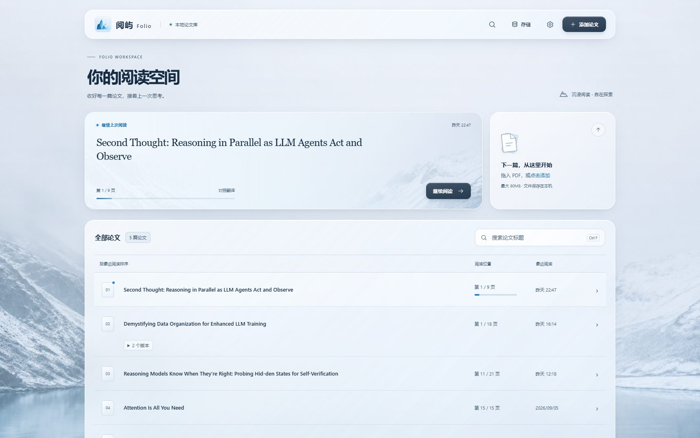
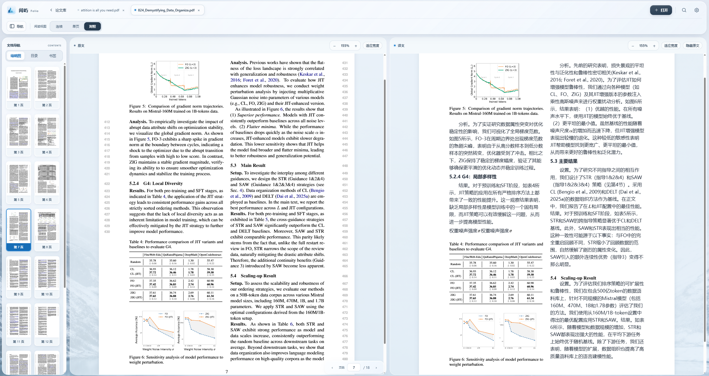
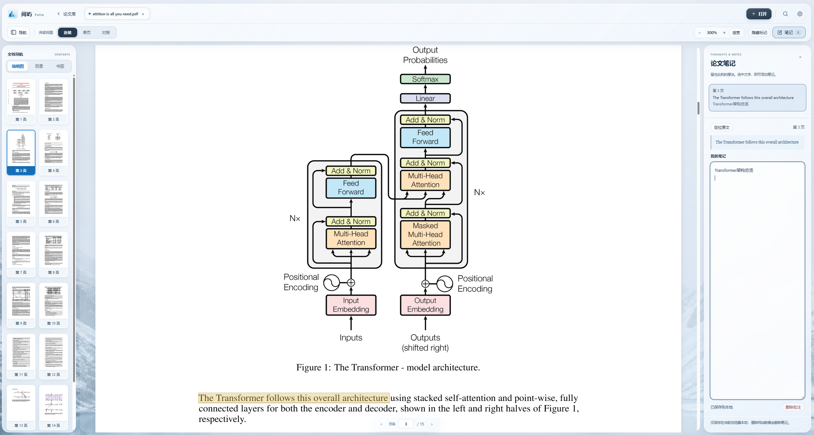
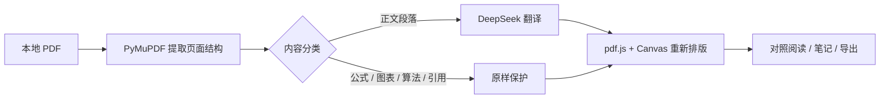

<p align="center">
  
</p>

<h1 align="center">阅屿 · Folio</h1>

<p align="center">
  <strong>让论文翻译之后，依然保持论文的样子。</strong><br>
  本地优先、版式还原、沉浸阅读与随文笔记的一体化论文阅读器。
</p>

<p align="center">
  
  
  
  
</p>

<p align="center">
  <strong>简体中文</strong> · <a href="README_EN.md">English</a>
</p>

<p align="center">
  <a href="https://github.com/Albertyang0x0/Folio/releases/latest/download/Folio-Portable-x64.zip"><strong>↓ 下载最新版 · Windows 便携版</strong></a><br>
  <sub>解压即用，无需单独安装 Python · <a href="https://github.com/Albertyang0x0/Folio/releases/latest">查看版本说明</a></sub>
</p>

<p align="center">
  
</p>

## 为什么做阅屿

阅屿是一款通过 **vibe coding** 打造的本地论文阅读与翻译工具。

许多论文翻译工具最终只输出一段连续文本，原文中的双栏结构、标题层级、图表位置、公式编号和引用关系也随之丢失。这样的译文虽然能够阅读，却很难与原论文逐段核对。另一种做法是直接调用 Agent 重建整篇译文，但这通常需要传递大量上下文，不仅 token 消耗较高，最终效果也容易受到模型和提示词的影响。

阅屿尝试在翻译效率与版式还原之间找到平衡。它从 PDF 中提取段落坐标、字体样式和页面结构，识别并保护图片、表格、公式、算法块与引用，只翻译真正需要翻译的正文，再将译文重新排回对应位置。你可以快速对照原文与译文，也可以像使用普通 PDF 阅读器一样搜索、缩放、添加高亮，并随手记录阅读中的想法。


## 核心亮点

### 高还原度的翻译排版

- 保留页面尺寸、栏数、段落位置、字号、粗体与斜体等视觉信息。
- 图片、图表、表格和算法块保持原貌，不交给语言模型改写。
- 引用原样保留，避免作者名、年份及引用顺序被错误翻译或拆散。
- 行内公式直接复用原 PDF 字形，并按正文基线重新排版。
- 独立公式、分式和公式编号作为整体处理，减少错位、拆分与顺序颠倒。
- 译文变长时自动换行、调整字号并向下延展，尽量避免文字互相覆盖。

<p align="center">
  
</p>

### 阅读不止于翻译

- 提供连续、单页和左右对照三种阅读模式。
- 对照模式中原文、译文可以独立缩放，也可以隐藏原文专注阅读译文。
- 支持精确到单词的全文搜索高亮，而不是笼统标记整个段落。
- 连续和单页模式可以直接拖动选择 PDF 文字并复制。
- 缩略图、目录与书签统一放在文档导航侧栏中。

### 随文高亮与笔记

在连续或单页模式中选中文字，即可创建一条和原文位置绑定的笔记。高亮可以随时隐藏或显示；点击笔记能够回到对应页和对应段落。笔记保存在本机，不修改原 PDF，也不会发送给翻译服务。

<p align="center">
  
</p>

### 一座属于自己的论文库

- 自动建立本地论文首页，优先从 PDF 内容中识别完整标题。
- 按论文标题搜索，并按最近阅读时间排列。
- 记住每篇论文的页码、阅读模式、缩放比例和滚动位置。
- 同一论文的不同 PDF 版本可合并展示，同时保留各自的阅读状态。
- 存储管理面板可以查看各类数据占用，并安全清理可重新生成的翻译缓存。

## 工作方式



PDF 文件始终保存在本机。只有需要翻译的文字段落会按照你的设置发送到 DeepSeek API；图片、整份 PDF、笔记和阅读历史不会上传到阅屿的服务器——因为阅屿没有公共业务服务器。

## 立即使用

### Windows 便携版

1. 在 GitHub **Releases** 页面下载 `Folio-Portable-x64.zip`。
2. 将 ZIP 完整解压到任意可写目录。
3. 双击 `Folio.exe`。
4. 在设置中填入自己的 DeepSeek API Key，即可开始翻译。

便携版已经包含 Python 运行环境，使用者不需要安装 Python。论文、缓存、设置和桌面窗口数据均位于程序旁的 `data/` 目录；迁移或备份时复制整个 Folio 文件夹即可。

> 请勿直接在 ZIP 预览窗口中运行。未签名的开源构建可能触发 Windows SmartScreen，可核对 Release 中提供的 SHA-256 后继续运行。

### 从源码运行

环境要求：Windows、Python 3.9+。建议使用 Python 3.10 或更高版本。

```powershell
python -m venv .venv
.venv\Scripts\pip install -r backend\requirements.txt
.venv\Scripts\python -m uvicorn main:app --app-dir backend --host 127.0.0.1 --port 8000
```

打开 `http://127.0.0.1:8000`。也可以直接运行 `start.bat`，由脚本创建虚拟环境、安装依赖并启动应用。

## 构建 Windows 便携版

```powershell
build_portable.bat
```

脚本会安装桌面构建依赖、使用 PyInstaller 生成无控制台的 onedir 应用，并输出：

```text
dist/Folio-Portable-x64.zip
```

桌面外壳基于 pywebview 与 Edge WebView2。Windows 11 和大多数 Windows 10 已预装 WebView2 Runtime。

## 数据与隐私

| 数据 | 保存位置 | 是否发送到第三方 |
| --- | --- | --- |
| 原始 PDF | 本机 `data/uploads/` | 否 |
| 页面解析与译文缓存 | 本机 `data/` | 否 |
| API Key | 当前浏览器或桌面 WebView 本地存储 | 仅用于请求你配置的翻译接口 |
| 待翻译正文 | 不建立公共云端副本 | 是，发送到你配置的 DeepSeek API |
| 笔记、书签与阅读进度 | 本机存储 | 否 |

本地服务只监听 `127.0.0.1`。错误日志不会记录 API Key 或上游服务的原始响应正文。

## 技术栈

| 层次 | 技术 |
| --- | --- |
| PDF 解析与导出 | PyMuPDF |
| 本地 API | FastAPI + Uvicorn |
| PDF 渲染 | pdf.js |
| 译文排版 | Canvas 2D + 自定义段落、公式与保护区布局 |
| 翻译服务 | DeepSeek Chat Completions API |
| Windows 桌面外壳 | pywebview + Edge WebView2 |
| 便携版构建 | PyInstaller |

## 项目结构

```text
Folio/
├── backend/              PDF 提取、翻译、缓存、导出与桌面入口
├── frontend/             阅读器界面、pdf.js 渲染、搜索与笔记
├── docs/images/          README 界面截图
├── packaging/            便携版说明、构建依赖与版本信息
├── scripts/              前端本地依赖下载脚本
├── FolioPortable.spec    PyInstaller 配置
├── build_portable.bat    Windows 便携版构建入口
└── start.bat             源码开发启动入口
```


## 参与贡献

欢迎提交 Issue、排版失败样例和 Pull Request。反馈 PDF 排版问题时，请尽量提供：

1. 出问题的页码与阅读模式；
2. 原文和译文截图；
3. 是否包含双栏、表格、算法或复杂公式；
4. 可公开分享的最小 PDF 样例，或能够复现结构的合成文件。

请不要在 Issue、日志或截图中提交 DeepSeek API Key、未公开论文或其他敏感信息。

## License

阅屿 · Folio 以 [MIT License](LICENSE) 开源。

---

<p align="center">
  <em>收好每一篇论文，接着上一次思考。</em>
</p>
