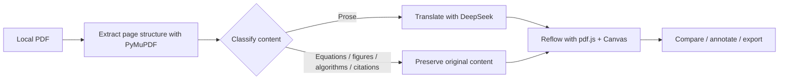

<p align="center">
  
</p>

<h1 align="center">Yueyu · Folio</h1>

<p align="center">
  <strong>Keep papers looking like papers—even after translation.</strong><br>
  A local-first academic reader for layout-preserving translation, focused reading, and contextual notes.
</p>

<p align="center">
  
  
  
  
</p>

<p align="center">
  <a href="README.md">简体中文</a> · <strong>English</strong>
</p>

<p align="center">
  <a href="https://github.com/Albertyang0x0/Folio/releases/latest/download/Folio-Portable-x64.zip"><strong>↓ Download the latest Windows portable build</strong></a><br>
  <sub>Extract and run—no separate Python installation required · <a href="https://github.com/Albertyang0x0/Folio/releases/latest">Release notes</a></sub>
</p>

<p align="center">
  
</p>

## Why Folio

Folio is a local academic paper reader and translator built through **vibe coding**.

Many paper translation tools flatten a document into a stream of text, discarding its columns, heading hierarchy, figure placement, equation numbers, and citation structure. The result may be readable, but it is difficult to compare against the original paragraph by paragraph. Asking an agent to reconstruct an entire translated document is another option, but it requires substantial context, consumes more tokens, and often produces results that vary with the model and prompt.

Folio aims for a practical balance between translation efficiency and layout fidelity. It extracts paragraph coordinates, typography, and page structure from the PDF; identifies and protects figures, tables, equations, algorithms, and citations; translates only the prose that needs translation; and places the result back into the corresponding regions. You can compare source and translation at a glance, or read the paper like a regular PDF—searching, zooming, highlighting, and capturing ideas as you go.


## Highlights

### High-fidelity translated layouts

- Preserve page dimensions, columns, paragraph positions, font sizes, bold text, and italics.
- Keep images, figures, tables, and algorithm blocks intact instead of asking the language model to rewrite them.
- Preserve citations verbatim so author names, years, and citation order are not mistranslated or split apart.
- Reuse the original PDF glyphs for inline equations and align them to the surrounding text baseline.
- Treat display equations, fractions, and equation numbers as coherent units to reduce splitting, displacement, and ordering errors.
- Reflow and resize longer translations while extending the translated page when necessary to avoid overlapping text.

<p align="center">
  
</p>

### More than translation

- Switch between continuous, single-page, and side-by-side reading modes.
- Zoom the source and translation independently, or hide the source to focus on the translation.
- Search the full paper with exact word-level highlights rather than highlighting entire paragraphs.
- Select and copy native PDF text in continuous and single-page modes.
- Browse thumbnails, the document outline, and bookmarks from one navigation panel.

### Contextual highlights and notes

Select text in continuous or single-page mode to create a note anchored to its exact location in the paper. Highlights can be shown or hidden at any time, and clicking a note takes you back to the corresponding page and passage. Notes stay on your computer, never modify the original PDF, and are never sent to the translation service.

<p align="center">
  
</p>

### A paper library of your own

- Build a local paper library and prefer complete titles extracted from PDF content over unreliable filenames.
- Search by title and sort papers by most recent reading time.
- Restore the page, reading mode, zoom level, and scroll position for every paper.
- Group multiple PDF versions of the same work while preserving each version's individual reading state.
- Inspect storage usage by category and safely clear translation caches that can be regenerated.

## How it works



The PDF itself always remains on your computer. Only prose that needs translation is sent to the DeepSeek API according to your settings. Images, the complete PDF, notes, and reading history are never uploaded to a Folio server—Folio has no public application server.

## Get started

### Windows portable edition

1. Download `Folio-Portable-x64.zip` from the GitHub **Releases** page.
2. Extract the complete archive to any writable directory.
3. Double-click `Folio.exe`.
4. Enter your own DeepSeek API key in Settings and start translating.

The portable edition includes its own Python runtime, so end users do not need to install Python. Papers, caches, settings, and desktop window data live in the `data/` directory beside the application. To migrate or back up Folio, copy the entire Folio folder.

> Do not run Folio directly from the ZIP preview. Unsigned open-source builds may trigger Windows SmartScreen; compare the file against the SHA-256 published with the Release before continuing.

### Run from source

Requirements: Windows and Python 3.9+. Python 3.10 or later is recommended.

```powershell
python -m venv .venv
.venv\Scripts\pip install -r backend\requirements.txt
.venv\Scripts\python -m uvicorn main:app --app-dir backend --host 127.0.0.1 --port 8000
```

Open `http://127.0.0.1:8000`. Alternatively, run `start.bat` to create the virtual environment, install dependencies, and start the application automatically.

## Build the Windows portable edition

```powershell
build_portable.bat
```

The script installs the desktop build dependencies, creates a windowed onedir application with PyInstaller, and outputs:

```text
dist/Folio-Portable-x64.zip
```

The desktop shell uses pywebview and Edge WebView2. Windows 11 and most Windows 10 installations already include the WebView2 Runtime.

## Data and privacy

| Data | Stored in | Sent to a third party? |
| --- | --- | --- |
| Original PDFs | Local `data/uploads/` | No |
| Parsed pages and translation cache | Local `data/` | No |
| API key | Current browser or desktop WebView local storage | Only used to call the translation endpoint you configure |
| Prose to translate | No public Folio cloud copy | Yes, sent to your configured DeepSeek API |
| Notes, bookmarks, and reading progress | Local storage | No |

The local service listens only on `127.0.0.1`. Error logs do not record API keys or raw upstream response bodies.

## Technology

| Layer | Technology |
| --- | --- |
| PDF parsing and export | PyMuPDF |
| Local API | FastAPI + Uvicorn |
| PDF rendering | pdf.js |
| Translation layout | Canvas 2D with custom paragraph, equation, and protected-region layout |
| Translation service | DeepSeek Chat Completions API |
| Windows desktop shell | pywebview + Edge WebView2 |
| Portable packaging | PyInstaller |

## Project structure

```text
Folio/
├── backend/              PDF extraction, translation, caching, export, and desktop entry point
├── frontend/             Reader UI, pdf.js rendering, search, and notes
├── docs/images/          README screenshots
├── packaging/            Portable documentation, build dependencies, and version metadata
├── scripts/              Frontend vendor download utilities
├── FolioPortable.spec    PyInstaller configuration
├── build_portable.bat    Windows portable build entry point
└── start.bat             Source development launcher
```

## Contributing

Issues, failing layout examples, and pull requests are welcome. When reporting a PDF layout problem, please include:

1. The affected page and reading mode.
2. Screenshots of both the source and translated views.
3. Whether the page contains multiple columns, tables, algorithms, or complex equations.
4. A minimal PDF that can be shared publicly, or a synthetic document that reproduces the same structure.

Never include a DeepSeek API key, an unpublished paper, or other sensitive information in an issue, log, or screenshot.

## License

Yueyu · Folio is open source under the [MIT License](LICENSE).

---

<p align="center">
  <em>Keep every paper. Continue every thought.</em>
</p>
